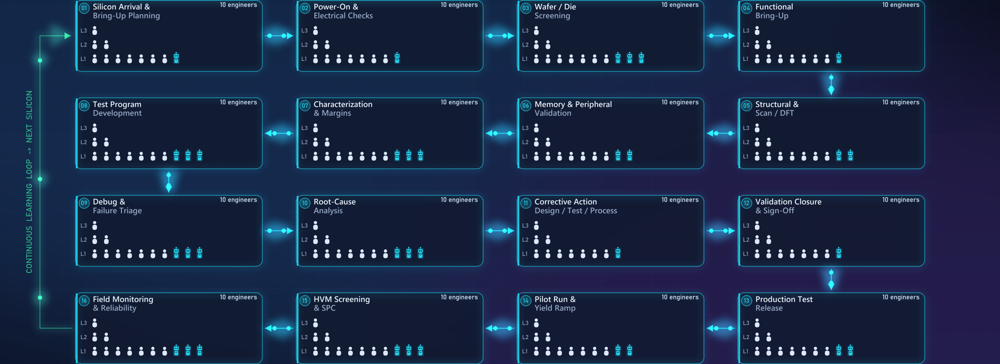

# Post-Silicon Validation: The AI Timeline

**How fast can AI actually move through post-silicon validation, and which parts of the job does it reach first?**

A three-layer model of engineering work, a stage-by-stage speed estimate across the validation lifecycle, and an honest account of what would make the estimate wrong.

This repository contains the written analysis, a seven-page visual summary, and the code that generated both.

---

## The short version

Every engineering job has three layers:

| Layer | What it is | Examples |
|---|---|---|
| **L3 Judgement** | What matters, what is trustworthy, what ships | Risk calls, escalation, customer commitments, lot sign-off |
| **L2 Design** | Which corners, which limits, which method | Test strategy, limit setting, coverage decisions, trade-offs |
| **L1 Execution** | Doing the task by hand | Pattern coding, log parsing, sweep execution, report assembly |

AI absorbs this stack from the bottom up. Layer 1 goes first because it is repetitive and well defined. Layer 3 barely moves, because its constraints are legal and physical rather than technical.

| Layer | Today | ~ +10 years |
|---|---|---|
| L3 Judgement | 2% | 20% |
| L2 Design | 10% | 60% |
| L1 Execution | 25% | 85% |

*All figures in this repository are illustrative projections. See [Limitations](#limitations).*

---

## The stages do not move at the same rate

The validation lifecycle is 16 stages in a closed loop. Averaging across them hides the most important fact: they automate at wildly different speeds, and the reason is rarely model capability.

### Fast — 70 to 85% at roughly ten years out

Wafer and die screening · Characterization analysis · Test program development · Debug and failure triage · Root-cause analysis · HVM screening and SPC · Field monitoring

These are pure data and code. No physical gate, no re-qualification gate.

### Medium — 40 to 60%

Structural and scan / DFT · Memory and peripheral validation · Production test release · Pilot run and yield ramp

Gated by tool qualification and correlation runs.

### Slow — 10 to 30%

Bring-up planning · Power-on and electrical checks · Functional bring-up · Corrective action · Validation closure and sign-off

Physical lab work, cross-organisation negotiation, legal accountability.

**Weighted across all 16 stages: about 54% for a leading team at roughly ten years out. Industry median closer to 25 to 35%.**

---

## What slows it down

Five brakes, none of which are about how good the models get.

1. **Qualification, not capability.** Changing a production test program means re-correlation, re-qualification and often customer approval. The blocker is not that the output is bad. It is that the tool which generated it is not qualified. This is a standards problem, not an engineering one.

2. **Validation is not software.** Probe cards, load boards, thermal chambers, handlers, bench instruments. Several stages need hands. Lab robotics moves at hardware speed, not model speed.

3. **Data debt is the real 90%.** Agents need clean, consistent, queryable test data. Most organisations have siloed STDF, test names that differ per product, and the decisive context living in engineers' heads. This is years of unglamorous data engineering before the interesting part starts.

4. **IP sensitivity caps model quality.** Test programs and silicon debug data are among the most guarded assets in the company. On-premise and air-gapped deployment trails frontier capability.

5. **The verification tax.** Reviewing unreliable AI output can be slower than doing the work yourself. Adoption only accelerates past a reliability threshold, and that threshold is high when a wafer lot is at stake.

---

## What speeds it up

1. **Vendors will drag the industry along.** AI-assisted design, verification and test-analytics tooling from the major EDA and ATE suppliers means companies do not have to build this themselves. Vendor-delivered capability adopts far faster than internal projects.

2. **Domain-specific language models already have a head start.** Domain-adapted models for chip design work have been public since 2023. That track has years on it, and the tooling around it is maturing.

3. **Adaptive test is already normal.** Real-time outlier detection and dynamic part-average testing run in high-volume production today. In several flows the automation baseline is already higher than people outside test assume.

---

## Product class matters more than company name

| Class | Speed | Why |
|---|---|---|
| Memory and HVM | Fastest | Huge repetition and data volume, thin margins forcing quick ROI |
| Datacenter and consumer logic | Fast | Shorter qualification chains, strong internal AI capability |
| Mobile | Medium | High volume, but heavy variant and certification load |
| Safety-critical automotive and industrial | Slowest in production | Long qualification chains and near-zero-defect targets. But pre-production bring-up, characterization and debug analytics move at full speed, because they need no re-qualification |

That last row is the practical one. The stages that move fastest are exactly the pre-production stages where re-qualification does not apply, which is where an engineer can start today without fighting the quality system.

---

## The claim I would defend

> Within about ten years, leading teams will have automated 40 to 60% of routine post-silicon execution, concentrated almost entirely in data analysis, triage and code generation. Physical bring-up and sign-off will barely move. Industry-wide it will be closer to 30%.

### Limitations

- The dominant unknown is frontier model capability. If it plateaus, only the fast tier happens. If scaling continues, the medium tier compresses.
- The slow tier is slow for legal and physical reasons. More capable models will not move it much.
- **The entry path is the open question.** Junior engineers traditionally learn the domain in Layer 1, by grepping datalogs and running sweeps. If that layer shrinks, how the next generation is trained is genuinely unresolved. Entry may shift to supervising agents rather than doing the work, which trades learning speed for depth of intuition.
- These are structural estimates derived from public industry dynamics. They are not internal data from any company, and no company is named or characterised in this analysis.
- The percentages are illustrative. The ordering is the argument, not the decimals.

### Why this is good news

- Semiconductor content keeps growing. Chiplets, 3D stacking and product variant explosion are adding validation surface every year.
- Automating 60% of today's tasks is entirely consistent with flat or growing validation headcount.
- The scarce skill becomes knowing when an agent is confidently wrong. That is domain expertise, and it does not transfer in from outside the industry.

---

## Contents

| Path | What it is |
|---|---|
| [`docs/post-silicon-validation-ai-timeline.pdf`](docs/post-silicon-validation-ai-timeline.pdf) | Seven-page visual summary, 1920x1080 landscape |
| [`docs/post-silicon-validation-ai-timeline.mp4`](docs/post-silicon-validation-ai-timeline.mp4) | 62 second animated walkthrough with generated soundtrack |
| [`docs/preview.gif`](docs/preview.gif) | Short silent teaser |

### The video

Sixteen lifecycle stages, each drawn as three layers. **Every stage holds exactly ten engineers at every horizon**, verified frame by frame across the whole runtime.

As agents arrive, the engineers do not disappear. They slide upward out of execution into design and judgement, while agents fill the space beneath them. Each agent keeps the colour of the horizon it arrived in, so colour accumulates rather than replaces. The blocks get visibly fuller over time, not emptier: the same team, with far more capacity around it.

Both the animation and the audio are generated procedurally. There is no video editor, no stock music and no external asset anywhere in the pipeline.

---

## Licence

[MIT](LICENSE). Reuse freely, attribution appreciated.

The figures and timelines in this repository are illustrative projections derived from public industry dynamics. They are not internal data from any company, and no company is named or characterised anywhere in this analysis.

---

*Rajendar Muddasani · Post-Silicon Validation & AI · August 2026*
